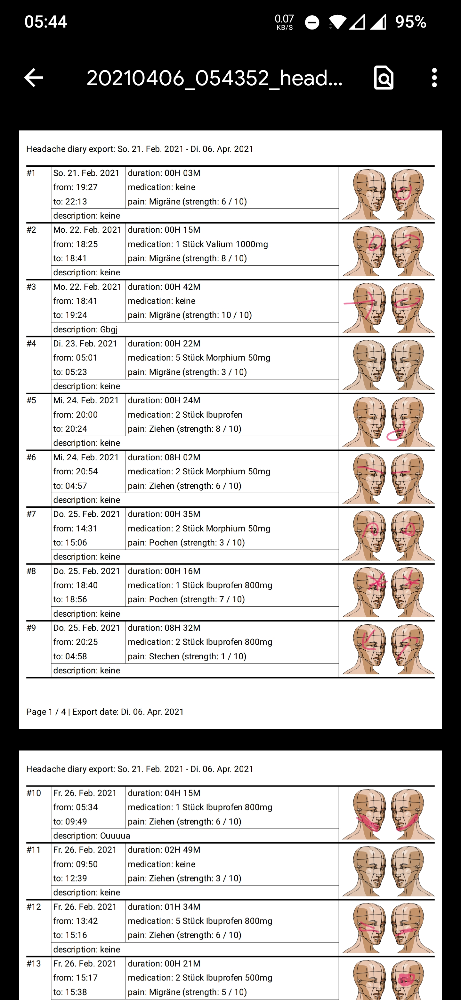

# Headi

Headi (Headache Diary) is a privacy-friendly app to log your headaches.  
No data is transferred to any cloud services. All data is stored locally only.  
Headi also offers a simple analysis of the recorded data. You can also export your logs as a CSV file for further analysis of the data.
To save your records you can also export your whole diary, or just parts of it, as a PDF.

I do not have any commercial interests. The app was created for private use and is intended to be available to everyone.

## Install

You can download Headi from F-Droid Store or from the this [repository](https://github.com/MrReSc/Headi/releases).

The apk from the F-Droid store is signed by F-Droid and the one on GuitHub is signed by me. There is no crossupdate possible because the apk's are signed differently.

## Contribute
Headi is an open source project. Your contributions are welcome. Below you will find some ways to help me:
- [x] I would like to publish the app on F-Droid. But I have no idea how that works.
- [ ] Headi still needs translations. You can help to translate Headi into your language. All you have to do is create an account at [Crowdin](https://crwd.in/headi) and translate the texts.
- [ ] Further analysis of the data in the app would be useful. If you have ideas, please share them. If you can code, you can implement them.
- [ ] There is still some potential to improve the design :smirk:
- [ ] If you are good at drawing, more beautiful pictures for the regions on the head would be very welcome.
- [x] An export function of the diary into a PDF that can be used for a visit to the doctor would also be a good function.
- [ ] No unit tests have been implemented yet either. If you like programming tests, I would be happy to receive them.
- [ ] With GitHub Actions you could implement CI/CD. That would also be great.

## Screenshots

  
    &nbsp; &nbsp; &nbsp; &nbsp;
  
    &nbsp; &nbsp; &nbsp; &nbsp;
  

  
    &nbsp; &nbsp; &nbsp; &nbsp;
  
    &nbsp; &nbsp; &nbsp; &nbsp;
  

  
    &nbsp; &nbsp; &nbsp; &nbsp;
  

## License
~~~
MIT License

Copyright (c) 2021 MrReSc

Permission is hereby granted, free of charge, to any person obtaining a copy
of this software and associated documentation files (the "Software"), to deal
in the Software without restriction, including without limitation the rights
to use, copy, modify, merge, publish, distribute, sublicense, and/or sell
copies of the Software, and to permit persons to whom the Software is
furnished to do so, subject to the following conditions:

The above copyright notice and this permission notice shall be included in all
copies or substantial portions of the Software.

THE SOFTWARE IS PROVIDED "AS IS", WITHOUT WARRANTY OF ANY KIND, EXPRESS OR
IMPLIED, INCLUDING BUT NOT LIMITED TO THE WARRANTIES OF MERCHANTABILITY,
FITNESS FOR A PARTICULAR PURPOSE AND NONINFRINGEMENT. IN NO EVENT SHALL THE
AUTHORS OR COPYRIGHT HOLDERS BE LIABLE FOR ANY CLAIM, DAMAGES OR OTHER
LIABILITY, WHETHER IN AN ACTION OF CONTRACT, TORT OR OTHERWISE, ARISING FROM,
OUT OF OR IN CONNECTION WITH THE SOFTWARE OR THE USE OR OTHER DEALINGS IN THE
SOFTWARE.
~~~

## Credits
### Libraries
- [TimerX](https://github.com/arsvechkarev/TimerX) Apache-2.0 License
- [FingerPaintView](https://github.com/PicnicSupermarket/FingerPaintView) MIT
- [MPAndroidChart](https://github.com/PhilJay/MPAndroidChart) Apache-2.0 License
- [Android About Page](https://github.com/medyo/android-about-page) MIT

### Pictures and Icons
- [Clker-Free-Vector-Images](https://pixabay.com/de/users/clker-free-vector-images-3736/?utm_source=link-attribution&amp;utm_medium=referral&amp;utm_campaign=image&amp;utm_content=29840)
- [Material Design Icons](https://materialdesignicons.com/)

### Translation
* Esperanto translation by @ScubyG
* Dutch translation by @tversteeg
